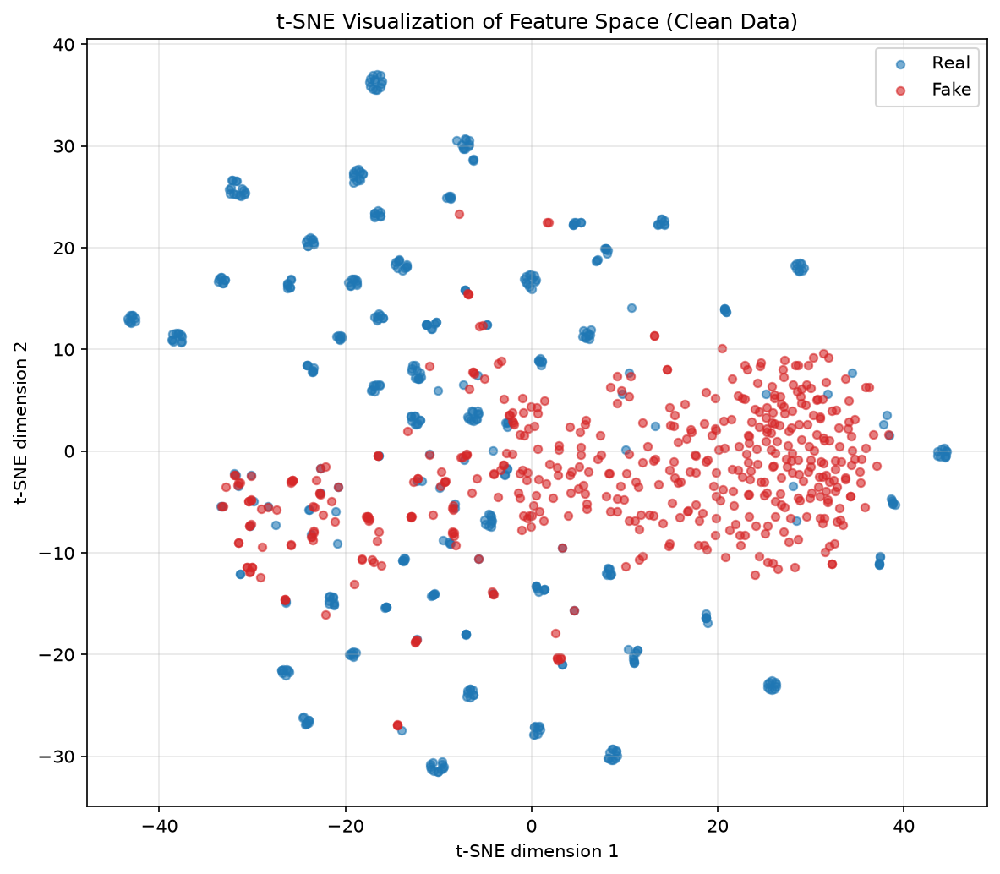
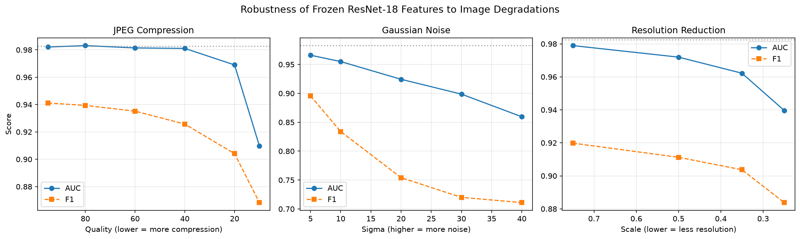
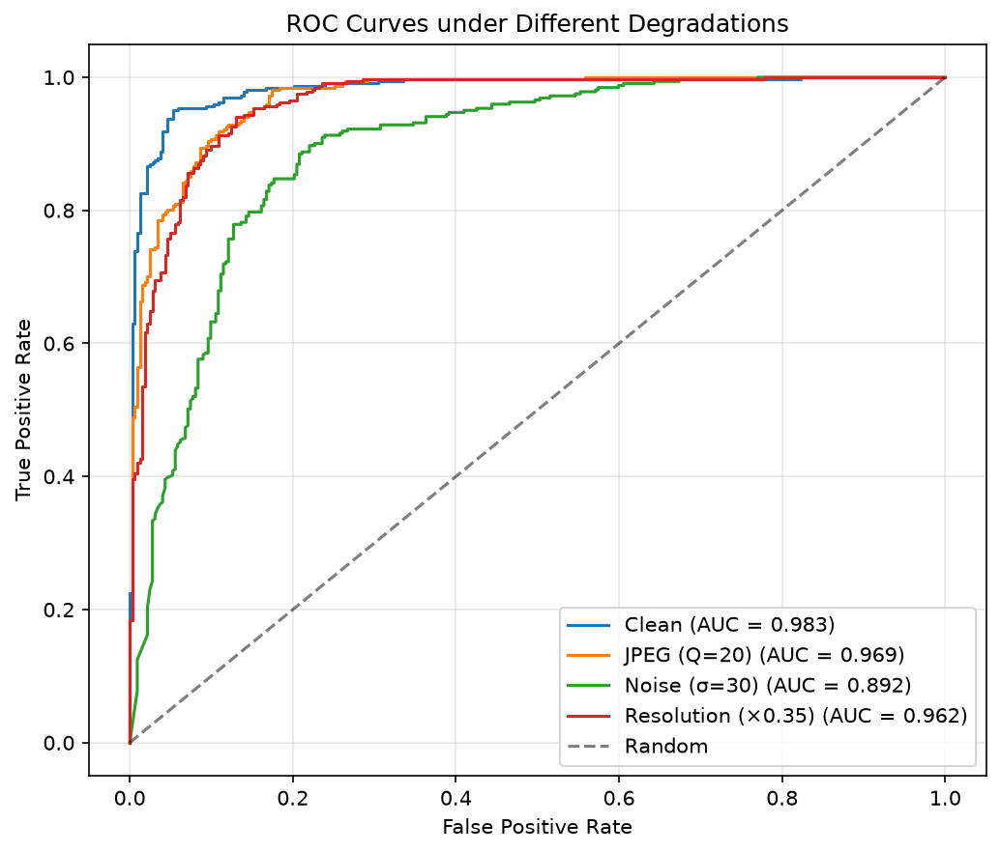
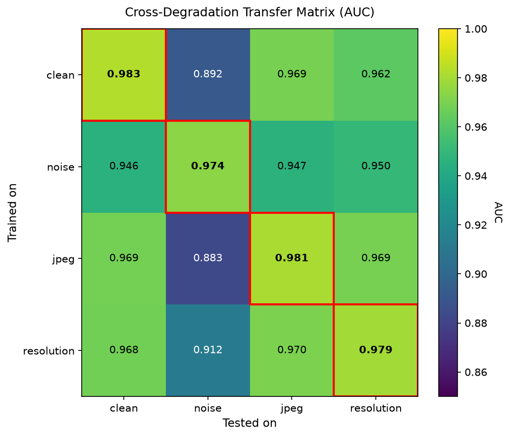
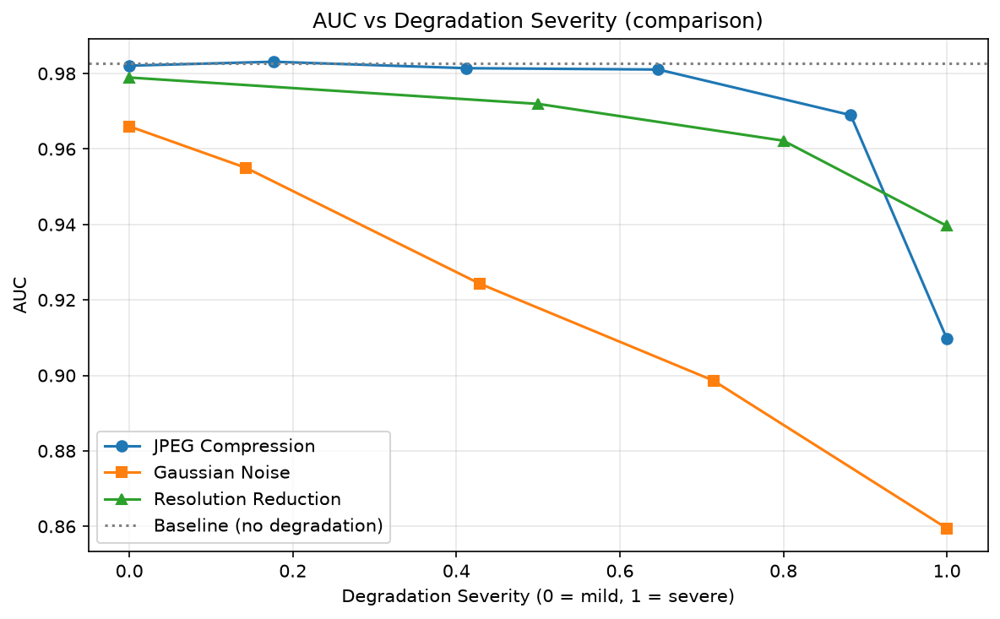

# Robustness and Generalization Study for Deepfake Detection

> **TL;DR** — Frozen ResNet-18 features + a linear probe detect AI-generated faces well on clean
> images (AUC **0.983**), but robustness varies sharply by distortion. **Gaussian noise** is by far
> the most damaging. Robustness transfers **asymmetrically** — training on the *hardest* distortion
> (noise) generalizes to easier ones, but not the reverse — and training on a **mix** of all
> distortions gives the most balanced model overall.

A limited-scale empirical study on the **robustness** and **generalization** of visual
representations for detecting AI-generated (fake) faces, using a **frozen pretrained network** and a
**linear probe** protocol. This repository contains the full, reproducible implementation.

**Bachelor's thesis — Amirhossein Ghane, Amirkabir University of Technology, 2025.**
Links: [LinkedIn](https://www.linkedin.com/in/amirhossein-ghane/) · [ORCID](https://orcid.org/0009-0003-1929-6278)

---

## Overview

This project evaluates how well frozen **ResNet-18** features (pretrained on ImageNet) can
distinguish real from fake face images, and how robust that ability is against three common image
degradations:

- **JPEG compression**
- **Gaussian noise**
- **Resolution reduction**

Instead of building a competitive detector, the goal is a controlled, reproducible measurement of
*relative* performance drop under degradation, and of how robustness **transfers** across
degradation types.

> **A note on terminology.** Here, *generalization* refers to **cross-degradation transfer** (does a
> probe trained under one distortion hold up under another?), **not** generalization to unseen
> generative models. Cross-generator generalization is left to future work (see
> [Limitations](#limitations--future-work)).

---

## Key Findings

- **Strong on clean data, uneven under distortion.** Clean AUC is **0.983**; the representation is
  fairly robust to **compression** and **resolution reduction**, but **fragile against noise**.
- **Noise is the dominant failure mode.** Under Gaussian noise, AUC drops the most (**−0.091**) and
  **precision collapses to 0.57** while recall stays near-perfect (**0.997**) — i.e., the model
  becomes *over-suspicious* and flags many real faces as fake.
- **Robustness transfers asymmetrically — hard → easy, not easy → hard.** A probe trained on the
  hardest distortion (noise) transfers to JPEG (AUC **0.947**), but a probe trained on JPEG fails
  under noise (AUC **0.883**).
- **A mix of all degradations is the most balanced overall** (mean AUC **0.967** across
  distortions, with no weak spot) — though its improvement over the noise-only model was **not
  statistically significant** (p = 0.32), likely due to having only three comparison points.

---

## Results

### 1. Baseline (clean data)

| Metric | Value |
|---|---|
| AUC | 0.9826 |
| F1 | 0.9444 |
| Precision | 0.9358 |
| Recall | 0.9533 |

Stability over 10 random seeds: mean AUC **0.9857**, std **0.0029**, 95% CI **[0.9835, 0.9878]**.



### 2. Performance under each degradation (representative level)

| Condition | AUC | F1 | Precision | Recall |
|---|---|---|---|---|
| Clean (baseline) | 0.9826 | 0.9444 | 0.9358 | 0.9533 |
| JPEG compression (q = 20) | 0.9690 | 0.9041 | 0.8839 | 0.9252 |
| Gaussian noise (σ = 30) | 0.8917 | 0.7232 | **0.5674** | 0.9969 |
| Resolution reduction (scale = 0.35) | 0.9622 | 0.9037 | 0.8616 | 0.9502 |

**AUC drop (clean → degraded):** JPEG −0.014 · **Noise −0.091 (largest)** · Resolution −0.020.

**Worst-case level per degradation:** JPEG (q = 10) 0.9097 · Noise (σ = 40) **0.8595** ·
Resolution (scale = 0.25) 0.9396.





### 3. Cross-degradation transfer matrix

Each cell is an AUC: a probe **trained** on the row's degradation, **tested** on the column's.

| Train ↓ / Test → | Clean | Noise | JPEG | Resolution |
|---|---|---|---|---|
| **Clean** | 0.9826 | 0.8917 | 0.9690 | 0.9622 |
| **Noise** | 0.9458 | 0.9737 | 0.9465 | 0.9499 |
| **JPEG** | 0.9688 | 0.8831 | 0.9809 | 0.9691 |
| **Resolution** | 0.9681 | 0.9121 | 0.9704 | 0.9792 |

**The asymmetry, in two numbers:** train-on-noise → test-on-JPEG = **0.9465** (holds up) vs.
train-on-JPEG → test-on-noise = **0.8831** (breaks down).



**Mean AUC across the three degradations, per training strategy:**

| Trained on | Mean AUC over degradations |
|---|---|
| Clean | 0.9410 |
| **Noise** | **0.9567** (best single-degradation) |
| JPEG | 0.9444 |
| Resolution | 0.9539 |

### 4. Mixed-degradation (augmentation) model

Training on a balanced mix of all degradations (~25% each):

| Training strategy | Mean AUC over degradations |
|---|---|
| Clean | 0.9410 |
| Best single (noise) | 0.9567 |
| **Mix of all** | **0.9669** (best) |

Per-condition performance of the mixed model — no weak spot:
Clean 0.9743 · Noise 0.9574 · JPEG 0.9718 · Resolution 0.9715.



### 5. Statistical significance

Mixed model vs. clean-trained model: mean difference **+0.026** (favoring the mix), **p = 0.32
(not significant)**. The improvement was consistent in direction across all three conditions; the
non-significance most likely reflects low statistical power (only three paired comparison points)
rather than absence of an effect.

### 6. Error analysis (clean data)

- Test images: 643 · Errors: **36 (5.6%)** — false positives (real → fake): 21 · false negatives
  (fake → real): 15.
- Mean prediction confidence: **0.458** on correct predictions vs. **0.293** on errors — the model
  tended to err *hesitantly* rather than confidently.

### 7. Confusion matrix per degradation

| Condition | Real ✓ | Real ✗ | Fake ✗ | Fake ✓ |
|---|---|---|---|---|
| Clean | 301 | 21 | 15 | 306 |
| JPEG | 283 | 39 | 24 | 297 |
| Noise | 78 | **244** | 1 | 320 |
| Resolution | 273 | 49 | 16 | 305 |

Under noise, **244 of 322 real faces were misclassified as fake** — the concrete signature of the
precision collapse noted above.

---

## Method

| Component | Choice |
|---|---|
| Feature extractor | Frozen ResNet-18 (ImageNet-pretrained), 512-dim features |
| Classifier | Logistic Regression (linear probe) |
| Dataset | DF40-derived face classification set (test split, 3212 images, balanced) |
| Split | 80/20 train/test (2569 / 643), `seed = 42`, stratified |
| Metrics | AUC, F1, Precision, Recall, confusion matrix |
| Compute | Feature extraction ~3.6 min on CPU (no GPU required) |

All experiments use a **fixed random seed (42)** for reproducibility.

---

## Repository Structure

### Pipeline
| File | Purpose |
|---|---|
| `make_manifest.py` | Builds a CSV manifest of all images |
| `extract_features.py` | Extracts frozen ResNet-18 features and caches them |
| `extract_degraded.py` | Extracts features for degraded train/test sets |
| `baseline.py` | Baseline evaluation on clean data |
| `toy_pipeline.py` | Small sanity-check run of the full pipeline |

### Robustness experiments
| File | Purpose |
|---|---|
| `robustness_jpeg.py` | JPEG compression robustness |
| `robustness_noise.py` | Gaussian noise robustness |
| `robustness_resolution.py` | Resolution reduction robustness |
| `transfer_matrix.py` | Cross-degradation transfer study |
| `augmented_model.py` | Mixed-degradation augmentation experiment |

### Analysis & figures
| File | Purpose |
|---|---|
| `full_metrics.py` | Full metric table (AUC/F1/Precision/Recall) + multi-seed |
| `roc_curves.py` | ROC curves per degradation |
| `tsne_plot.py` | t-SNE visualization of feature space |
| `error_analysis.py` | Error analysis (hardest / most confident mistakes) |
| `confusion_per_degradation.py` | Confusion matrix per degradation |
| `statistical_test.py` | Confidence intervals + paired significance test |
| `plot_robustness.py`, `plot_transfer.py` | Figure generation |

---

## Requirements

```
Python 3.x
torch, torchvision
scikit-learn
numpy, pandas
matplotlib, scipy
pillow
```

Install with:

```bash
pip install -r requirements.txt
```

> For full reproducibility, consider pinning exact versions (e.g. `torch==x.y.z`) in
> `requirements.txt` rather than leaving them unversioned.

---

## How to Run

The scripts expect the dataset in a `Data/test/` folder (with `real/` and `fake/` subfolders) next
to the code, then run in order:

```bash
python make_manifest.py       # build manifest.csv
python extract_features.py    # cache clean features -> features.npz
python extract_degraded.py    # cache degraded features -> degraded_features.npz
python baseline.py            # baseline metrics
python full_metrics.py        # full metric table + multi-seed
python roc_curves.py          # ROC figure
python tsne_plot.py           # t-SNE figure
python transfer_matrix.py     # transfer matrix
python augmented_model.py     # augmentation experiment
```

---

## Dataset

A DF40-derived face classification set, publicly available on Hugging Face:
**https://huggingface.co/datasets/pujanpaudel/deepfake_face_classification**. Only the balanced
test split (1606 real + 1606 fake = 3212 images) is used, split internally 80/20 for train/test.

The underlying benchmark is DF40 (Yan et al., NeurIPS 2024, `arXiv:2406.13495`).

---

## Limitations & Future Work

This is a deliberately **limited-scale** study; absolute accuracy is not the goal, and several
choices bound its scope:

- **Single backbone** (ResNet-18) and **single dataset** (DF40-derived) — results may not transfer
  to other architectures or data sources.
- **Linear probe only** — features are frozen; end-to-end fine-tuning is not explored.
- **"Generalization" = cross-degradation**, not cross-generator. Robustness to *unseen generative
  models* is untested.
- **Low statistical power** in the significance test (three paired points).

Natural extensions: multiple/modern backbones, fine-tuning, evaluation against **unseen generators**,
a wider range and severity of corruptions, and larger comparison sets for stronger significance.

---

## How to Cite

```bibtex
@misc{ghane2025deepfakerobustness,
  author       = {Amirhossein Ghane},
  title        = {Robustness and Generalization of Visual Representations
                  in Detecting AI-Generated Faces},
  year         = {2025},
  howpublished = {Bachelor's thesis, Amirkabir University of Technology},
  note         = {\url{https://github.com/amirhosseinghane/deepfake-robustness-study}}
}
```

Please also cite the DF40 benchmark this study builds on:

```bibtex
@article{yan2024df40,
  title   = {DF40: Toward Next-Generation Deepfake Detection},
  author  = {Yan, Zhiyuan and Yao, Taiping and Chen, Shen and Zhao, Yandan and
             Fu, Xinghe and Zhu, Junwei and Luo, Donghao and Yuan, Li and
             Wang, Chengjie and Ding, Shouhong and others},
  journal = {arXiv preprint arXiv:2406.13495},
  year    = {2024}
}
```

---

*All numbers above are from the project's actual experiments.*
